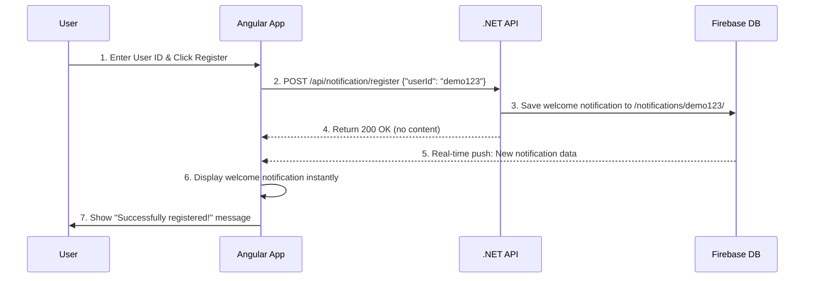
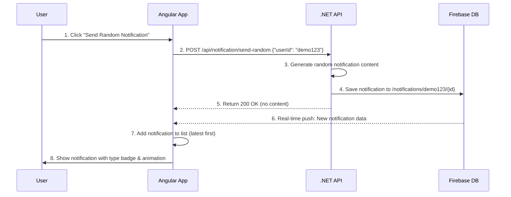
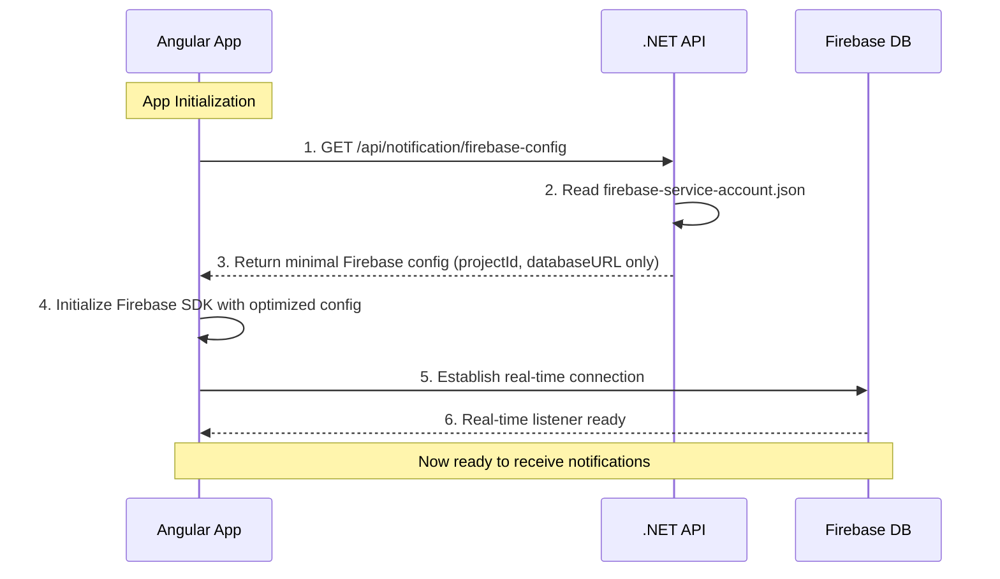
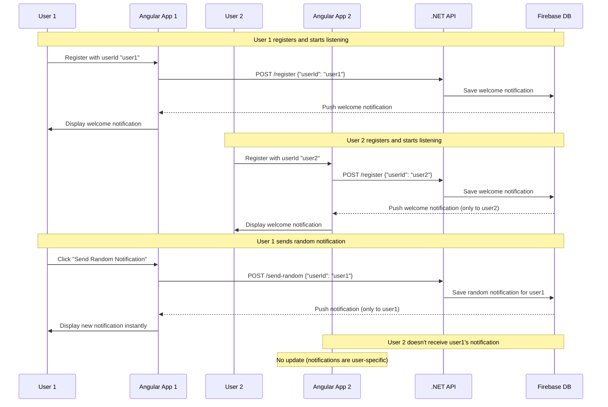

# Firebase Realtime Database Notification Demo

A demo project showing real-time notification system using .NET 9 WebAPI + Firebase Realtime Database + Angular 20.

## What This Demo Shows

This project demonstrates:
- **Real-time notifications** that appear instantly without page refresh
- **Two-flow notification system**: User registration + Random notifications
- **Firebase Realtime Database integration** for instant data sync
- **Simple architecture**: Backend sends to Firebase → Frontend listens to Firebase

## Quick Setup

### 1. Backend Setup (.NET 9)

```bash
cd BackendAPI
dotnet restore
dotnet run
```
API runs at: `http://localhost:5100`

**Firebase Configuration:**
- Place your `firebase-service-account.json` in the `BackendAPI/` folder
- The system uses **smart configuration** with multiple options:
  1. **Auto-mode**: Extracts `project_id` from service account and builds URL automatically
  2. **Manual-mode**: Set `Firebase:DatabaseUrl` in `appsettings.json` 
  3. **Environment-mode**: Use `FIREBASE_DATABASE_URL` environment variable
- Supports multiple Firebase regions (default: `asia-southeast1`)
- No hardcoded URLs needed!

### 2. Frontend Setup (Angular 20)

```bash
cd AngularApp
npm install
npm start
```
App runs at: `http://localhost:4200`

## Demo Flow

### Step 1: User Registration
1. Open `http://localhost:4200`
2. Enter a User ID (e.g., "demo123")
3. Click **Register**
4. ✅ Welcome notification appears instantly in real-time

### Step 2: Send Random Notifications
1. Click **Send Random Notification** button
2. ✅ Random notification appears in real-time within seconds
3. Repeat to see multiple notifications

### Step 3: Real-time Experience
- All notifications appear **instantly** without page refresh
- **No polling** - Firebase pushes updates in real-time
- Notifications show with different type badges (welcome, random)

## How It Works

```
[Angular App] ←──── Real-time ────→ [Firebase Database] ←──── API calls ────→ [.NET API]
     ↑                                       ↑                                    ↑
   Listens to                            Stores                               Sends
  Firebase DB                         notifications                      notifications
```

### The Flow:
1. **User action** → Angular calls .NET API
2. **.NET API** → Saves notification to Firebase Realtime Database
3. **Firebase** → Pushes update to Angular app in real-time
4. **Angular** → Displays notification instantly

## Sequence Diagram

### User Registration Flow


### Send Random Notification Flow


### Firebase Config Loading Flow


### Complete Real-time Notification Flow


### API Endpoints

**Register User:**
```bash
POST /api/notification/register
{ "userId": "demo123" }
```

**Send Random Notification:**
```bash
POST /api/notification/send-random  
{ "userId": "demo123" }
```

**Get Firebase Config:**
```bash
GET /api/notification/firebase-config
```

## Firebase Database Structure

```json
{
  "notifications": {
    "a1b2c3d4e5f6": {
      "notification-id-1": {
        "title": "Welcome!",
        "body": "You have successfully registered to our notification system.",
        "timestamp": "2025-08-01T10:30:00Z",
        "type": "welcome"
      },
      "notification-id-2": {
        "title": "Breaking News!",
        "body": "You have received a new message from the system.",
        "timestamp": "2025-08-01T11:15:00Z", 
        "type": "random"
      }
    }
  }
}
```

**Note:** User IDs are hashed (SHA256, first 12 characters) for privacy. For example, `"demo123"` becomes `"a1b2c3d4e5f6"`.

## Key Demo Features

✅ **Instant Real-time Updates** - No refresh needed  
✅ **Simple Two-Flow System** - Register + Send notifications  
✅ **Clean UI** - Modern Angular interface with type badges  
✅ **Firebase Integration** - Real-time database synchronization  
✅ **Centralized Config** - Firebase settings loaded from backend  
✅ **Privacy Protection** - User IDs are hashed in Firebase paths  

## Testing the Demo

### Quick Test with curl:
```bash
# Test API
curl http://localhost:5100/api/notification/test

# Register user
curl -X POST http://localhost:5100/api/notification/register \
  -H "Content-Type: application/json" \
  -d '{"userId": "demo123"}'

# Send notification
curl -X POST http://localhost:5100/api/notification/send-random \
  -H "Content-Type: application/json" \
  -d '{"userId": "demo123"}'
```

### Watch in Firebase Console:
1. Open Firebase Console → Realtime Database
2. Watch `notifications/demo123` node
3. Send notifications and see data appear in real-time

---

**This is a demo project.** For production use, add authentication, error handling, and security measures.
